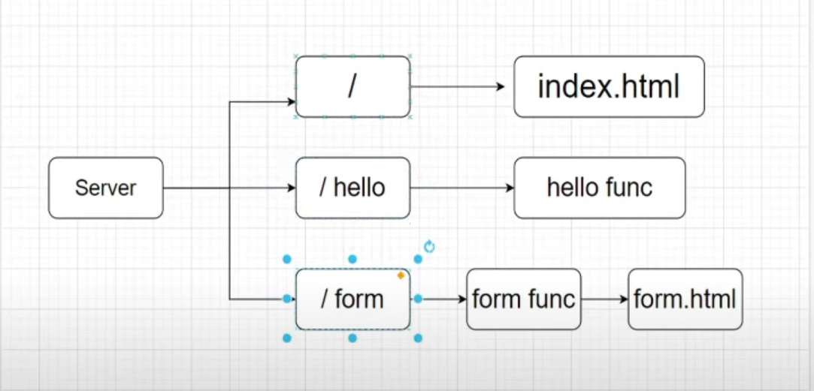

# Go Server

A basic web server in golang.

Available routes:
- localhost:8080/
- localhost:8080/hello
- localhost:8080/form.html

## Running the project
- run `go build .` in the project directory terminal.
- run `./main` in the project directory terminal